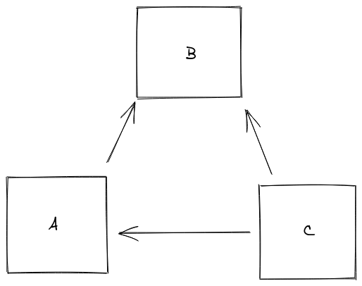

# dtb

Decentralized Text-based Blog on your commandline.

## How it works

Clients connect to each other p2p & share articles they have.
This way even if you're offline your articles can be seeded to people who
follow you by people who follow you.

You write your articles & send them to people who're online.
Example scenario:

Assuming B is a coworker of A, meaning they boot their computers (mostly) at
the same time, B can run dtb in the background, seeding his articles over the
internet to A.

And let's say A never shuts his computer down. C (who follows both) if B is
offline can get B's articles from A if he is online at the time. This way,
exchange of information becomes non-central, open & organic.
